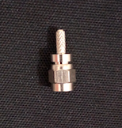
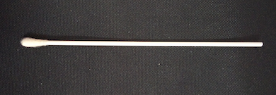

Description:
============

I found this video a video on Youtube showing an antenna made of coins ( I think 5 Rubles coins ) used to listen piretes on 250 MHz:

You can find the video at this link:
https://www.youtube.com/watch?v=z4WHc-C5h1s&t=0s&index=55&list=PL9Hh9cBVrfE_-53maenhiGAD8cpTM8yAW

I'm testing a reproduction made of two 50c Euro coins.

Materials:
=========

- Two 50c Euro coins;
- One piece of copper wire ( ~= 5cm , diameter ~= 1 mm);
- A Bic Pen;

- Liquid corrector for documents;

- Epoxy clay;
- Acid (necessary to solder the coins, I used chloridric acid of the type used to clean the the wc. Two drops are sufficient ).
- Sandpaper ( a little piece to clean the junction points);
- Connector compatible with your radio equipment ( I used a SMA connector).

- A plastic pipe of small diameter ( I used a cotton fioc);

Tools:
======

- Soledring gas torch;
- Soldering iron;
- Wise;
- Pliers;
- A saw with small teeth;
- Drill or equivalent tool able to create an hole in the pen's cap;

Build Process:
==============

1. Clean the two coins where you want solder ( the juction point) and apply a drop of acid for on than area for both coins;
2. I use a gas torch to solder the coins ( at the moment I haven't a powerful electric soldering iron, if you have one you can use it isead of a gas torch);

3. With a soldering iron, apply the tin on one extremity of the copper wire;
4. Solder the copper wire to the coin junction point ( the prepared extremity);

5. Cut the copper wire to the right length. You have to calculate that dimension mesuring your commector. You should cut the wire at the righ point so you can easily mount the connector and , at the end, to avoid problems mounting the antenna on the radio; 
6. To gain mechanical strength, I placed a piece of plastic pipe neare the junction point.

7. Because I used a crimpable connector, that type used on coaxial cables, I insulated the copper iron part inserted in the connector with liquid paper corrector;
8. I build a support for the antenna using a piece of Bic pen. I made a hole in the rear plastic cap to insert the connector;

9. I finished the antenna making a cover for the coins made of epoxy clay and I applied a little piece of neat-shrink tubing between the connector and the antenna.

Testing:
========

The performances of this antenna aren't enthusiastic, but apparently it works. I'll add more information as soon as possible.
