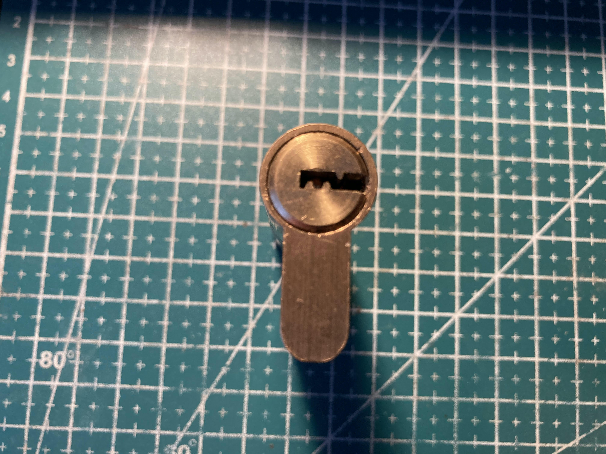
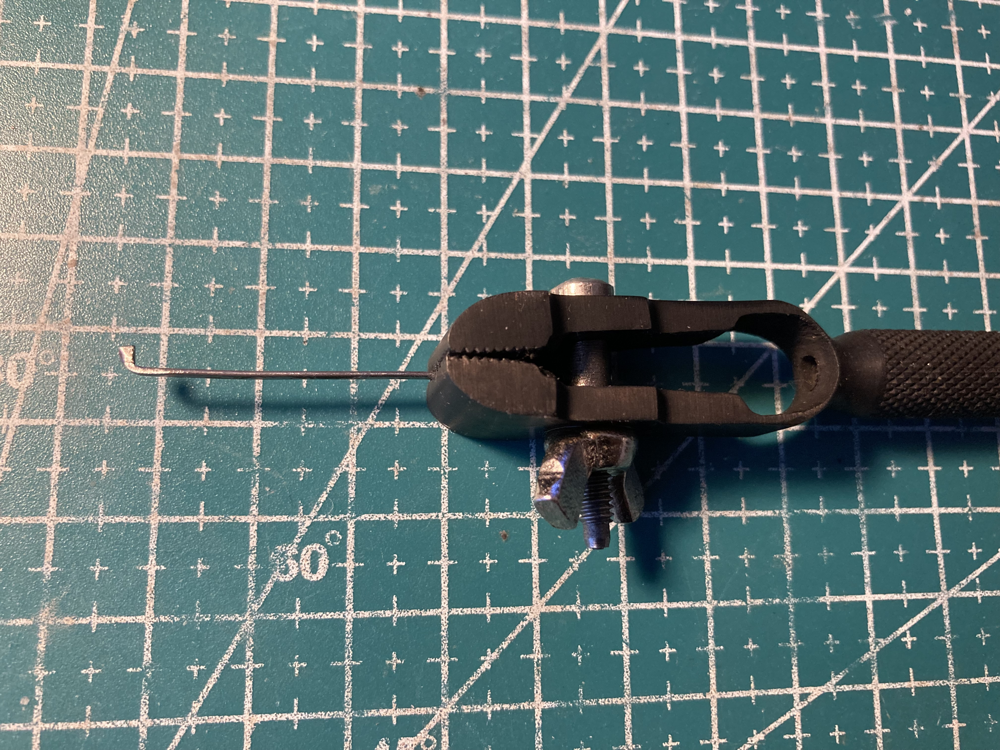
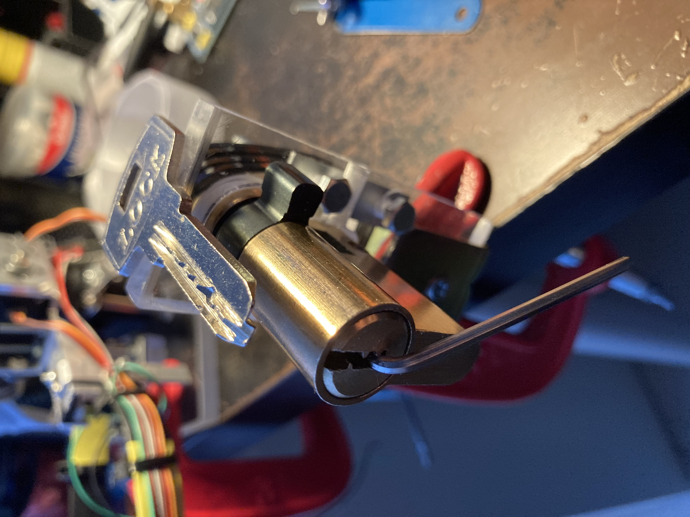
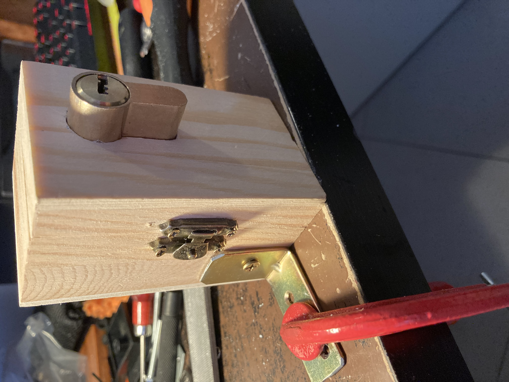

Disclaimer:
============

This document is presented for educational purpose, I'll be not responsible of any different usage. Opening locks don't belong to you without permissions is illegal.

Description:
============

This is my firts T-Lock (closed):  

This anonymous lock has 5 classic pins, so none of them has security features.

Materials:
=========

- 1 piece of flat steel, approximately 1 mm X 0.5 mm of section, 4.5 cm long.

Tools:
======

- Vise;
- Pliers;
- Propane torch;

Build Process:
==============

- Using the flat piece of steel, forge a pick approximately 2 mm X 1 mm, shaping it like a flag:

Open Lock:
==========

I also used the vise as handle for the pick in the opening operation:

Extra, "Door Simulator":
========================

I also built a support for the lock with a little wooden box, simulating a door:

